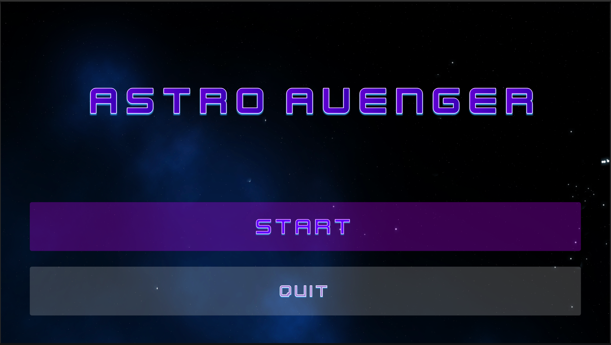
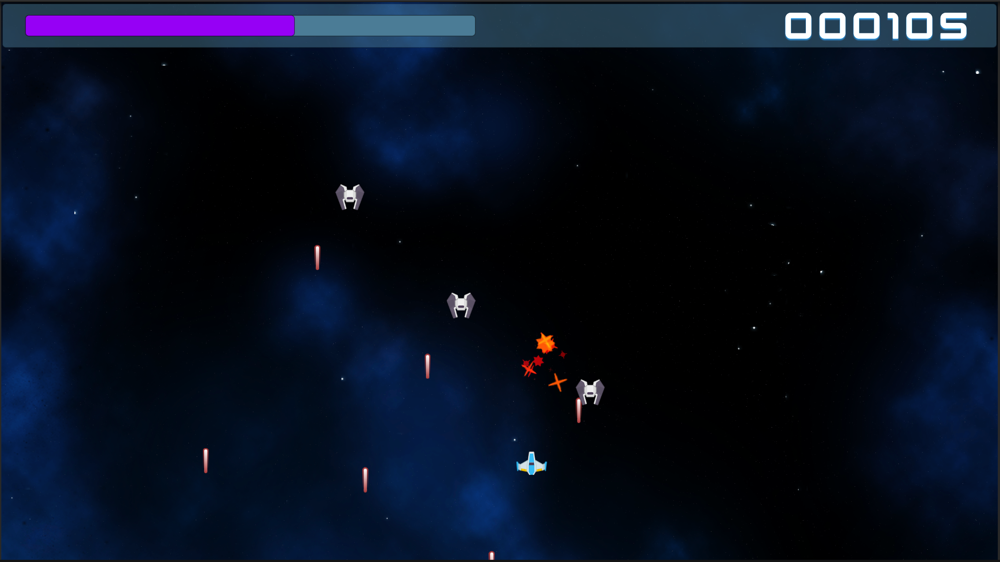
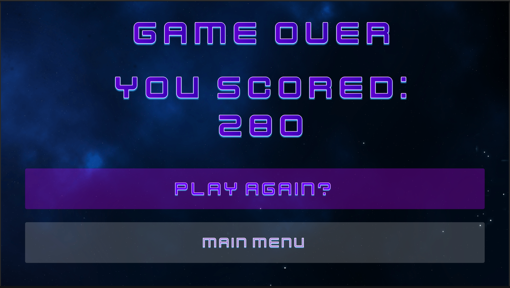

# Astro-Avenger
A fun and challenging 2D space shooter built in Unity where players doge waves of incoming ships.
This project helped me master Unity fundamentals including C# scripting, RigidBodys and Simple UI design

---

## Features

- Player movement and shooting mechanics
- AI-controlled enemy waves with configurable spawn behavior
- Health system with visual and audio damage feedback
- Scrolling background for dynamic visuals
- Score tracking and game over UI
- Camera shake effect to enhance impact

---

## Screenshots

*(All screenshots are in the `Assets/Screenshots` folder)*

| Main Menu                                     |                          
|-----------------------------------------------|
|  |

| Gameplay                                  |  
|-------------------------------------------|
|  |

| Game Over Screen                              |
|-----------------------------------------------|
|  |

---

## What I Learned

- Singleton pattern implementation for game managers
- ScriptableObjects for flexible wave configurations
- Unity Input System for player controls
- Coroutines for continuous actions like shooting and spawning
- UI programming for health, score, and game over screens
- Camera shake and audio effects for immersive gameplay
- Scrolling background via texture offset manipulation
